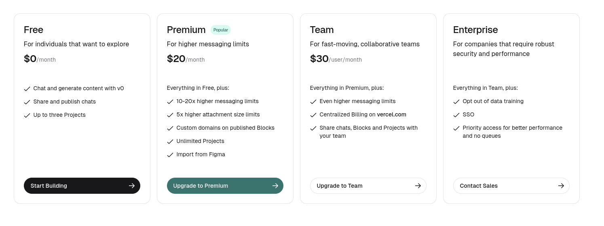
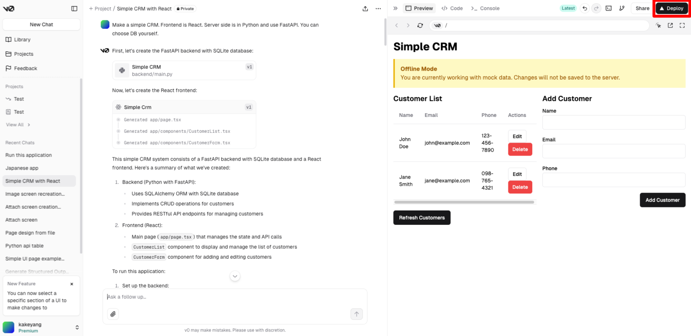
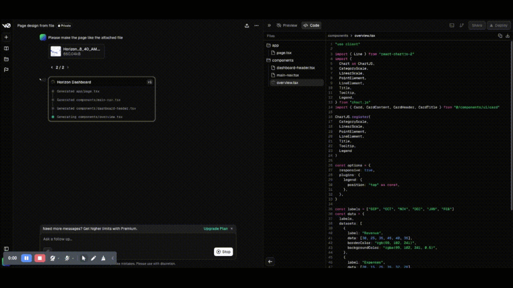

# v0.dev

<div align="center">
  
  <h3>AI-powered web application development</h3>
  <p>Build stunning web applications with the power of AI</p>
  
  <div>
    <a href="https://v0.dev">Try v0.dev</a> •
    <a href="#features">Features</a> •
    <a href="#how-it-works">How It Works</a> •
    <a href="#getting-started">Getting Started</a> •
    <a href="#examples">Examples</a>
  </div>
</div>

<br />

## What is v0.dev?

v0 by Vercel is a generative AI tool that revolutionizes web development by transforming natural language descriptions and design mockups into production-ready code. Whether you're a seasoned developer or just getting started, v0.dev helps you build beautiful, responsive, and functional web applications with ease.



## Features

- 🚀 **Text-to-App Generation** - Describe your app in plain language and get code instantly
- 🎨 **Design-to-Code** - Upload mockups and designs and convert them to working code
- 🧩 **Framework Support** - Works with React, Vue, Svelte, and HTML with CSS
- 📱 **Responsive Design** - All generated designs work seamlessly across devices
- 🔄 **Figma Integration** - Seamless workflow between design and development
- ⚡ **Rapid Prototyping** - Quickly iterate on ideas and bring them to life

## How It Works

v0.dev utilizes a chat-based interface similar to ChatGPT, making it intuitive and easy to use:

1. **Describe or Upload** - Explain what you want to build or upload a design mockup
2. **Generate Options** - The AI engine creates initial versions of your application
3. **Customize** - Refine the output using natural language instructions
4. **Export Code** - Get clean, production-ready code to integrate into your project



## Getting Started

```bash
# No installation needed!
# Just visit v0.dev to get started
```

Visit [v0.dev](https://v0.dev) and start building with AI right away! No complex setup required.

## Tips for Effective Use

- **Start Simple**: Begin with basic components before attempting complex designs
- **Be Specific**: Provide clear, detailed descriptions for better results
- **Iterate**: Use feedback cycles to refine your generated designs
- **Combine Components**: Build complex applications by combining simpler components

## Examples

Here are some examples of what you can build with v0.dev:

- E-commerce product pages
- Admin dashboards
- Landing pages
- Contact forms
- Data visualization interfaces
- And much more!

## Modes

v0.dev supports both light and dark themes for your development experience:

<div align="center">
  
  
</div>

## Community

Have questions or want to share your creations? Join our community:

- Open an [issue](https://github.com/likhonsheikhofficial/v0.dev/issues) for questions
- Check out community examples in the [examples folder](https://github.com/likhonsheikhofficial/v0.dev/tree/main/examples)
- Follow [Guillermo Rauch](https://twitter.com/rauchg) for updates

## Limitations

While v0.dev is powerful, it's important to be aware of its limitations:

- Complex interactions may require manual refinement
- Generated code might need optimization for production use
- Accessibility compliance should be verified manually

## License

This repository contains v0.dev examples and documentation. Refer to [Vercel's terms](https://vercel.com/terms) for actual v0.dev usage terms.

---

<div align="center">
  <p>Created with ❤️ by the community</p>
  <p>
    <a href="https://twitter.com/vercel">Twitter</a> •
    <a href="https://vercel.com/blog">Blog</a> •
    <a href="https://vercel.com">Vercel</a>
  </p>
</div>
